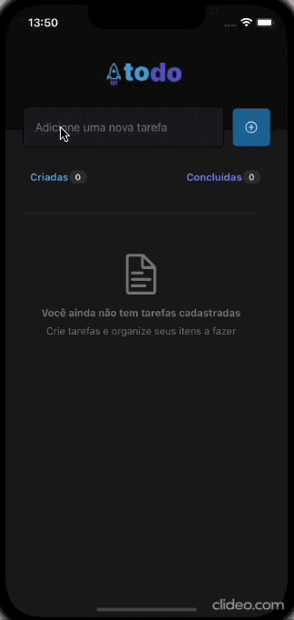

<div align="center" style="padding-bottom:30px; background:transparent">

</div>

## 💻 Projeto

Todo-List é um projeto proposto para o desafio de fundamentos de React Native da Rocketseat.

## 🚀 Tecnologias utilizadas

- [React Native](https://reactnative.dev/)
- [Typescript](https://www.typescriptlang.org)
- [Vector Icons](https://github.com/oblador/react-native-vector-icons)

### Instalação

Clone o repositório do Projeto

```
https://github.com/josanjohnata/rocketseat/tree/main/Ignite/react-native/desafios/todolist

```

Acesse o diretório do projeto

```
cd todolist

```

Instale as dependências

```
yarn ou sudo yarn (com yarn )

npm install ou sudo npm install (com npm)

```

Start o aplicativo

```
expo start (com expo)

npm run android

npm run ios

```
